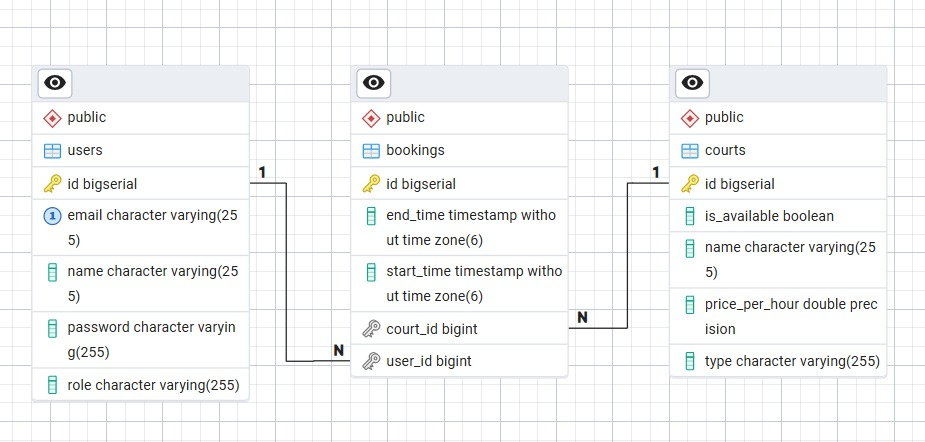

# sports-court-booking
Gestion y reserva de canchas

## Integrantes
Rodrigo Aguilar - AE22001
 Samuel Timoteo Cortez Hernandez   - CH21024
 Daniel Contreras - CR11019
 Katherine Tatiana Hernandez Hernandez - HH20017

Katherine Tatiana Hernández Hernández - HH20017
## Descripción del Proyecto

Sports Court Booking es una aplicación web diseñada para facilitar la administración y reserva de canchas deportivas. El sistema surge ante la necesidad de llevar un control organizado de las canchas disponibles, evitando conflictos de horarios, pérdidas de información y procesos manuales al momento de realizar una reserva.

La aplicación permite centralizar la gestión de las reservas mediante una plataforma accesible para los usuarios, mejorando el control de disponibilidad y optimizando la administración de los espacios deportivos.

### Funciones principales

- Registro y administración de canchas deportivas.
- Creación, consulta, actualización y eliminación de reservas.
- Gestión de usuarios del sistema.
- Consulta de disponibilidad de horarios.
- Almacenamiento de información en PostgreSQL.
- Consumo de servicios REST desarrollados con Spring Boot.
- Interfaz web desarrollada con React.
- Despliegue del sistema mediante Docker Compose.

## Diagrama Entidad-Relación

El siguiente diagrama muestra la estructura de la base de datos utilizada por el sistema, incluyendo las entidades principales y sus relaciones.

