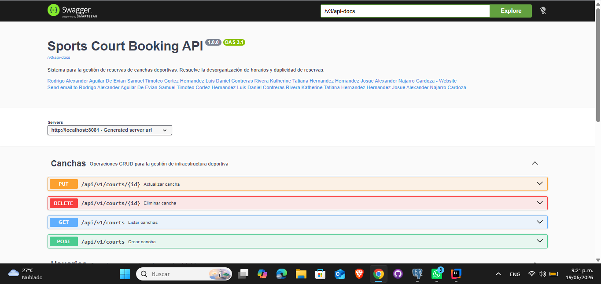
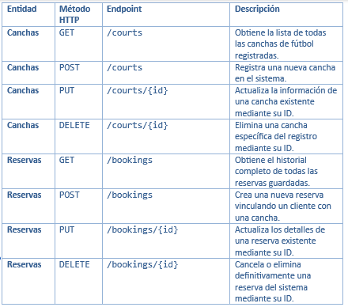
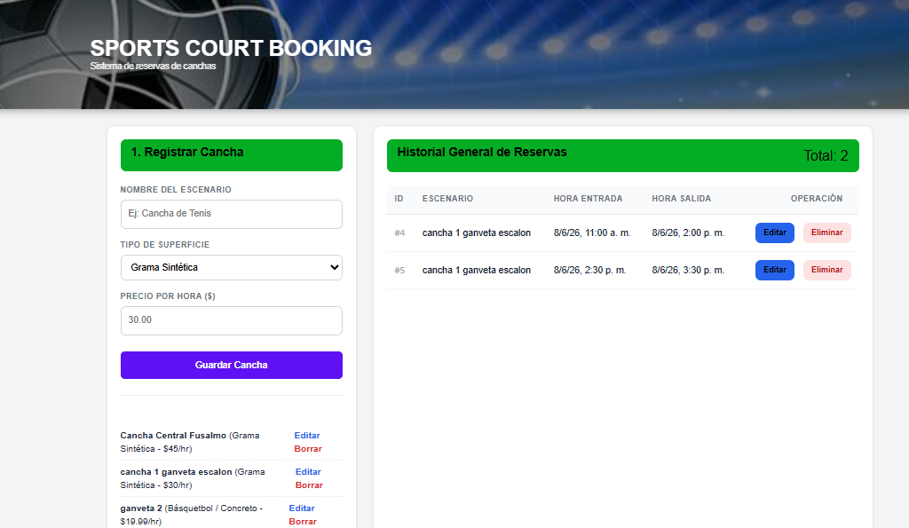

# ⚽ Sports Court Booking - Sistema de Reservas de Canchas de Fútbol

## Integrantes
Rodrigo Alexander Aguilar De Evian - AE22001
<br/>Samuel Timoteo Cortez Hernandez - CH21024
<br/>Luis Daniel Contreras Rivera - CR11019
<br/>Katherine Tatiana Hernandez Hernandez - HH20017
<br/>Josue Alexander Najarro Cardoza - NC23009

## Descripción del Proyecto

Sports Court Booking es una aplicación web diseñada para facilitar la administración y reserva de canchas deportivas. El sistema surge ante la necesidad de llevar un control organizado de las canchas disponibles, evitando conflictos de horarios, pérdidas de información y procesos manuales al momento de realizar una reserva.

La aplicación permite centralizar la gestión de las reservas mediante una plataforma accesible para los usuarios, mejorando el control de disponibilidad y optimizando la administración de los espacios deportivos.

### Funciones principales

- Registro y administración de canchas deportivas.
- Creación, consulta, actualización y eliminación de reservas.
- Gestión de usuarios del sistema.
- Consulta de disponibilidad de horarios.
- Almacenamiento de información en PostgreSQL.
- Consumo de servicios REST desarrollados con Spring Boot.
- Interfaz web desarrollada con React.
- Despliegue del sistema mediante Docker Compose.

## Diagrama Entidad-Relación

El siguiente diagrama muestra la estructura de la base de datos utilizada por el sistema, incluyendo las entidades principales y sus relaciones.


##  Manual de Despliegue

A continuación, se detallan las instrucciones paso a paso para compilar y levantar el sistema completo utilizando la infraestructura como código de Docker Compose.

### 📋 Requisitos Previos
1. **Docker:** Tener instalado Docker Desktop (en Windows/Mac) o el motor de Docker (en Linux) y asegurarse de que el servicio esté en ejecución.
2. **Base de Datos:** Tener instalado PostgreSQL de forma local (nativa) y en ejecución. Debe existir una base de datos configurada con los siguientes parámetros:
    * Nombre de la base de datos: `canchas_db`
    * Usuario: `postgres`
    * Contraseña: `password123`

### ⚙️ Instrucciones de Ejecución

**Paso 1: Ubicarse en el proyecto**
Abre tu terminal preferida (PowerShell, CMD o bash) y navega hasta la carpeta raíz del repositorio:
```bash
cd sports-court-booking
```
**Paso 2: Levantar la infraestructura**
Ejecuta el comando de orquestación para construir las imágenes optimizadas y levantar los contenedores en segundo plano:
```bash
docker compose up --build -d
```
**Paso 3: Validar el despliegue**
Comprueba que los contenedores integrados (app_backend y app_frontend) se hayan creado y mantengan el estado Up (corriendo):
```bash
docker compose ps
```

**Paso 4: Acceder al sistema**
Una vez levantados los servicios, accede a la aplicación desde tu navegador web:

Frontend (Interfaz de Usuario): Ingresa a http://localhost

Backend (API): El servicio se ejecuta en el puerto 8081.

**Paso 5: Detener y limpiar el sistema**
Cuando finalices la sesión y desees apagar los contenedores de forma segura, ejecuta:
```bash
docker compose down
```
## Evidencias de Funcionamiento
   A continuación, se presentan las evidencias de la correcta ejecución de la API y la integración con la interfaz de usuario.

### Documentación en Swagger


### Tabla de Rutas (Endpoints) del Backend
El backend expone una API RESTful para la gestión de las canchas de fútbol y el historial de reservas. URL Base: http://localhost:8081/api/v1


## Capturas de las Vistas (Frontend)

### Vista Principal (Listado y Registro de Canchas, historial de reservas):


### Vista principal de Reservas:

